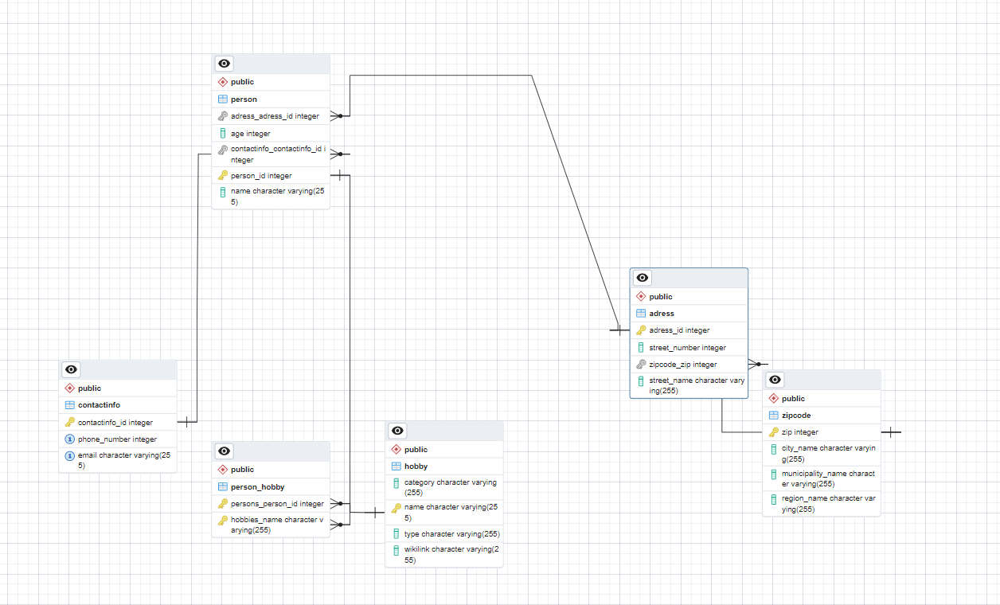

# SP1-Match
# // desc of your business idea

# Domain model:
# 
# EER diagram: 
# 
#
# Group work:
We've been in a group throughout the 3 semesters, and our general strategy is as follows:
Setup project, split up project, talk at 9-10 am through Discord to discuss said project. 
in between meetings, we do what we can do be active in helping with issues and problemsolving over Discord chat or do ad-hoc calls.
Usually we'd make a KanBan board through GitHub Projects, but given the small amount of the branches we'd be making and their sizes, we decided on doing this project without a KanBan board.

 We started Monday (04/09) by making a first draft of the domain model and getting it approved by a teacher.
 We setup a Github Repo for the project, inviting Mikkel and Malde.
 We added a new branch to the github project, that we proceeded to use for a baseline implementations of hibernate, as a safety backup base.
 We made a new branch for our entities.
 We made our model folder and our entities, establishing the connection between entities early while continuing the thought process of how the project should come along.
 We made interfaces for our DAO classes, to establish proper OOP as well as securing readability and making the project simple to split up between group members.
 Everyone decided on an interface whose implementation we'd work on. 
 Everyone made a branch for their own DAO iplementation.

 Tues (05/09) We had a meeting over Discord at 10am, wherein we discussed how our seperate projects had proceeded as well as contributing to one anothers problemsolving, to great success. Thankfully.
 We discussed the next steps for the project, and made branches according to subject and split up again.

 Wed (06/09) We had a meeting over Discord at 10am, primarily for problemsolving and helping, as we were headed towards finishing the project, but we did have a fair few problems with testing that we somewhat ironed out.

 Thurs(07/09) We're gonna have a meeting at night, seeing as a group member works throughout the day Thursday. Topics of discussion: README.md, merging everything together and potential(highly likely) problemsolving, testing, review points, making sure everything is as its supposed to, bug reports that we discover last minute and wont be able to fix in time and handing it in.

Branches were made as they were needed, making sure everything flows nicely.
We always make a "testMain". It's the branch we merge everything together into, fix problems, THEN we push to main. This ensures whatever hits main is bugfree(ish).

 

 
 

